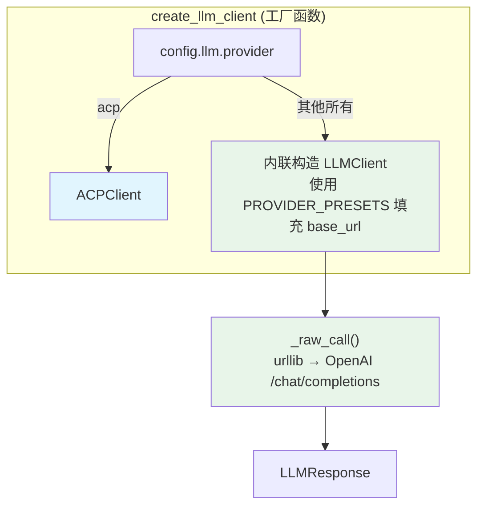
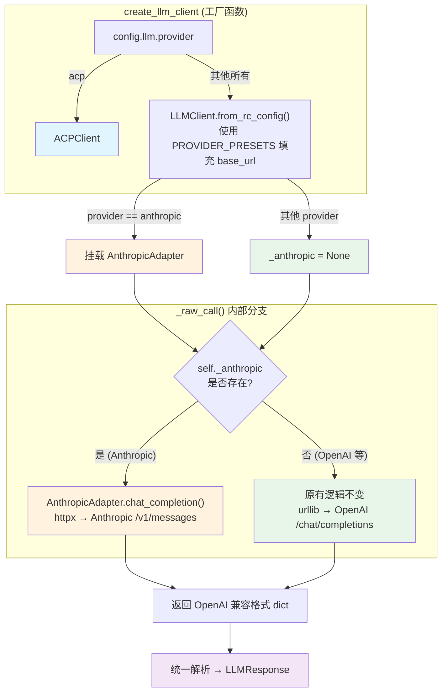
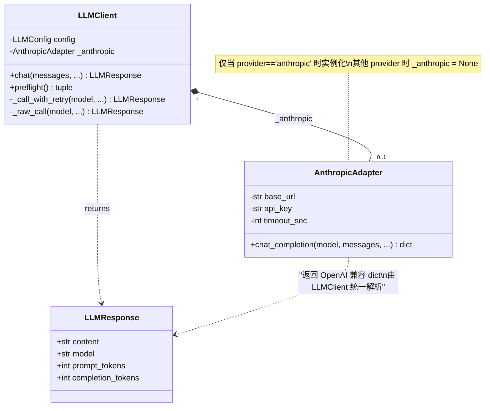
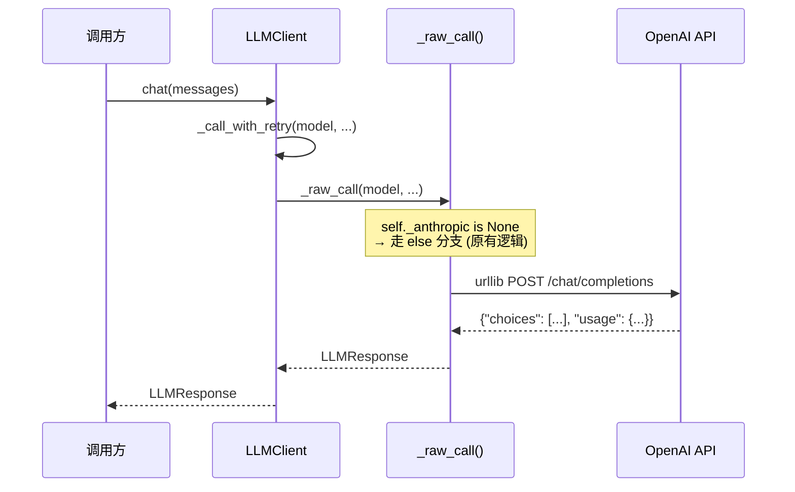
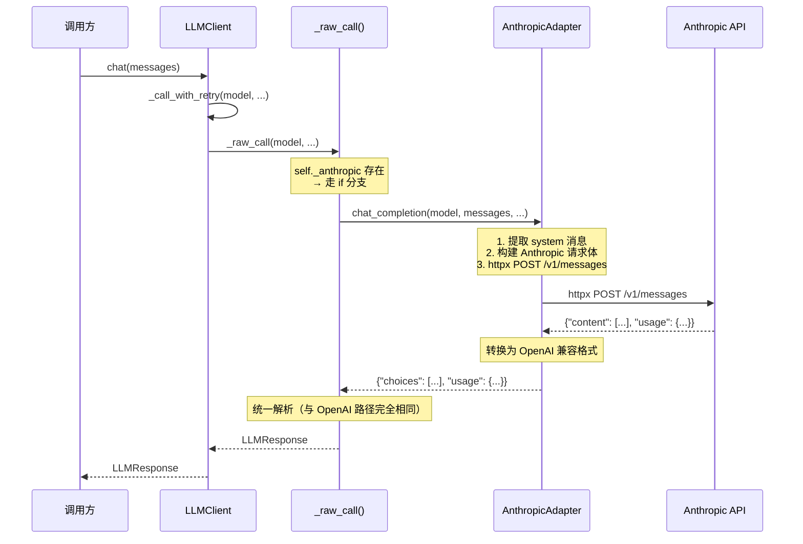
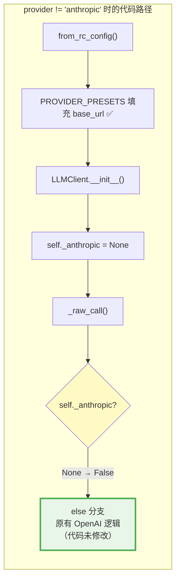
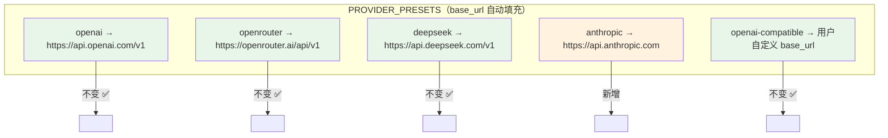
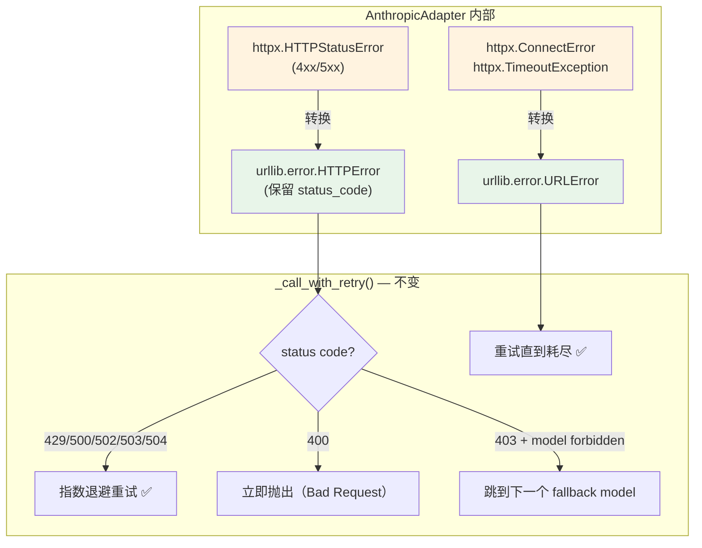

# Anthropic Messages API Adapter — 改动说明

> 本文档详细描述了为 ResearchClaw LLM 模块引入 Anthropic Messages API 原生支持的改动内容，
> 并通过架构图说明本次改动 **不影响现有 OpenAI / OpenRouter / DeepSeek 等 provider 的任何行为**。

---

## 目录

1. [改动背景](#1-改动背景)
2. [架构总览 — 改动前后对比](#2-架构总览--改动前后对比)
3. [核心设计：适配器模式](#3-核心设计适配器模式)
4. [调用流程详解](#4-调用流程详解)
5. [对现有 Provider 零影响的保证](#5-对现有-provider-零影响的保证)
6. [变更文件清单](#6-变更文件清单)
7. [异常处理与重试机制](#7-异常处理与重试机制)
8. [配置示例](#8-配置示例)
9. [新增依赖](#9-新增依赖)

---

## 1. 改动背景

ResearchClaw 的 LLM 模块原先仅支持 **OpenAI Chat Completions API 格式**（含兼容此格式的 OpenRouter、DeepSeek 等）。
Anthropic 的 Claude 系列模型使用独立的 **Messages API**，其请求/响应结构与 OpenAI 格式存在显著差异：

| 差异点 | OpenAI 格式 | Anthropic 格式 |
|---|---|---|
| 认证方式 | `Authorization: Bearer <key>` | `x-api-key: <key>` |
| System 消息 | 放在 `messages` 数组中 | 独立的 `system` 字段 |
| 端点路径 | `/v1/chat/completions` | `/v1/messages` |
| 响应结构 | `choices[0].message.content` | `content[0].text` |
| Token 统计 | `prompt_tokens` / `completion_tokens` | `input_tokens` / `output_tokens` |

为了原生支持 Anthropic API 而不影响现有功能，我们采用了 **适配器模式（Adapter Pattern）**。

---

## 2. 架构总览 — 改动前后对比

### 改动前



### 改动后



> 绿色 = 原有逻辑（未修改），橙色 = 新增 Anthropic 路径，紫色 = 共享的统一出口。

---

## 3. 核心设计：适配器模式



**关键设计决策：**

- `AnthropicAdapter` 是 `LLMClient` 的一个 **可选内部组件**，不是独立的客户端类
- 适配器返回 **OpenAI 兼容格式的 dict**，由 `_raw_call()` 的统一出口解析为 `LLMResponse`
- 当 `_anthropic is None` 时，`_raw_call()` 走 **完全不变的原有 OpenAI 路径**

---

## 4. 调用流程详解

以下时序图展示了两种 provider 各自的完整调用链路：

### OpenAI / OpenRouter / DeepSeek（原有流程，零改动）



### Anthropic（新增流程）



---

## 5. 对现有 Provider 零影响的保证



**零影响的 5 重保证：**

| # | 保证机制 | 说明 |
|---|---|---|
| 1 | **条件初始化** | `AnthropicAdapter` 仅在 `provider == "anthropic"` 时实例化，其他 provider 不触发任何新代码 |
| 2 | **`_anthropic = None`** | `__init__` 中默认设为 `None`，非 Anthropic provider 永远不会进入适配器分支 |
| 3 | **else 分支 = 原代码** | `_raw_call()` 的 else 分支包含的是 **未修改的** OpenAI urllib 调用逻辑 |
| 4 | **PROVIDER_PRESETS 保留** | 恢复了 preset base_url 回退逻辑，`openai` / `openrouter` / `deepseek` 的自动 URL 填充行为与之前一致 |
| 5 | **统一出口** | 两条路径最终都产出相同结构的 dict，由同一段代码解析为 `LLMResponse` |

### PROVIDER_PRESETS 对照表



---

## 6. 变更文件清单

| 文件路径 | 变更类型 | 改动说明 |
|---|---|---|
| `researchclaw/llm/__init__.py` | 修改 | 添加 `"anthropic"` preset；简化工厂函数委托给 `from_rc_config()` |
| `researchclaw/llm/client.py` | 修改 | `from_rc_config()` 恢复 PRESETS 逻辑 + 条件挂载适配器；`_raw_call()` 添加 if/else 分支 |
| `researchclaw/llm/anthropic_adapter.py` | **新增** | `AnthropicAdapter` 类 — Anthropic Messages API → OpenAI 兼容格式转换 |
| `tests/test_anthropic.py` | **新增** | Anthropic API 连通性测试脚本 |
| `pyproject.toml` | 修改 | 添加 `httpx` 为 optional dependency (`[anthropic]` extra) |
| `.gitignore` | 修改 | 添加 `run.log` |

---

## 7. 异常处理与重试机制

Anthropic 适配器内部将 httpx 异常 **转换为 urllib 标准异常**，确保上层重试逻辑无需修改：



这意味着 Anthropic 路径享有与 OpenAI 路径 **完全相同的重试策略**：指数退避 + jitter + model fallback chain。

---

## 8. 配置示例

### 使用 Anthropic（新增）

```yaml
llm:
  provider: anthropic
  # base_url 可省略，自动使用 https://api.anthropic.com
  api_key_env: ANTHROPIC_API_KEY
  primary_model: claude-sonnet-4-20250514
  fallback_models:
    - claude-haiku-4-5-20251001
```

### 使用 OpenAI（不变）

```yaml
llm:
  provider: openai
  # base_url 可省略，自动使用 https://api.openai.com/v1
  api_key_env: OPENAI_API_KEY
  primary_model: gpt-4o
  fallback_models:
    - gpt-4.1
    - gpt-4o-mini
```

### 使用 OpenRouter（不变）

```yaml
llm:
  provider: openrouter
  api_key_env: OPENROUTER_API_KEY
  primary_model: anthropic/claude-sonnet-4-20250514
```

---

## 9. 新增依赖

| 依赖 | 版本要求 | 安装方式 | 说明 |
|---|---|---|---|
| `httpx` | `>=0.24` | `pip install researchclaw[anthropic]` | **可选依赖**，仅 Anthropic provider 需要 |

不使用 Anthropic provider 的用户 **无需安装 httpx**，`pip install researchclaw` 的行为完全不变。

---

> **总结**: 本次改动通过适配器模式在 `_raw_call()` 内部添加了一条 Anthropic 专用路径。
> 当 provider 不是 `"anthropic"` 时，`self._anthropic` 为 `None`，代码执行路径与改动前 **完全一致**，
> 不触及任何新增代码，不引入任何新依赖。
